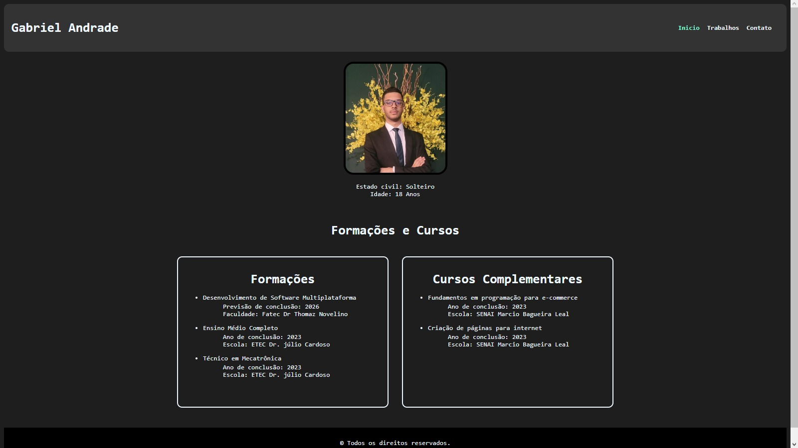
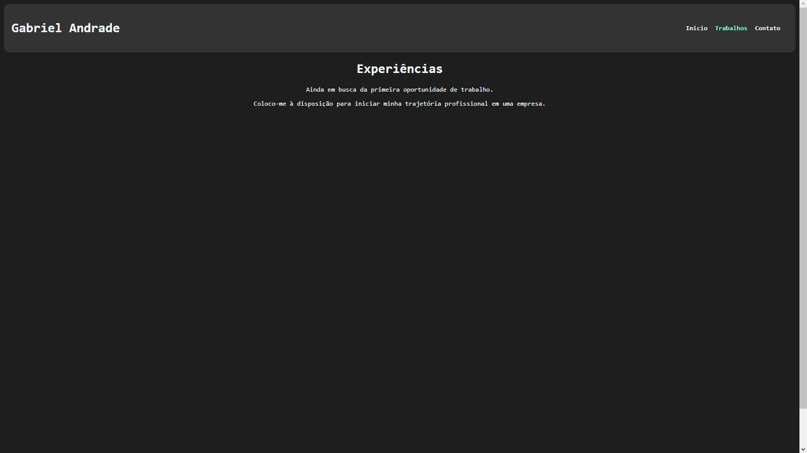

# Meu Curriculo

Um site breve sobre algumas informações do meu currículo

## 🚀 Acessando o site

<h4>Você pode acessar o site pelo link</h4> https://curriculo-aleixo-52c42a.netlify.app

## Descrição

Um site sobre o meu currículo. Provavelmente está desatualizado no momento. Mas por enquanto é só isso. 

## Imagens do site

    

 

    

 

    

 

## 🛠️ Construído com

Visual Studio Code utilizando HTML e CSS.

