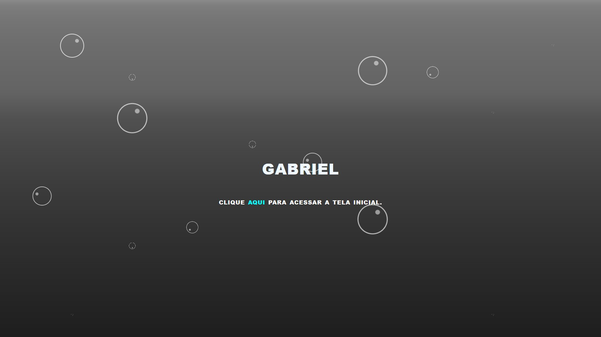
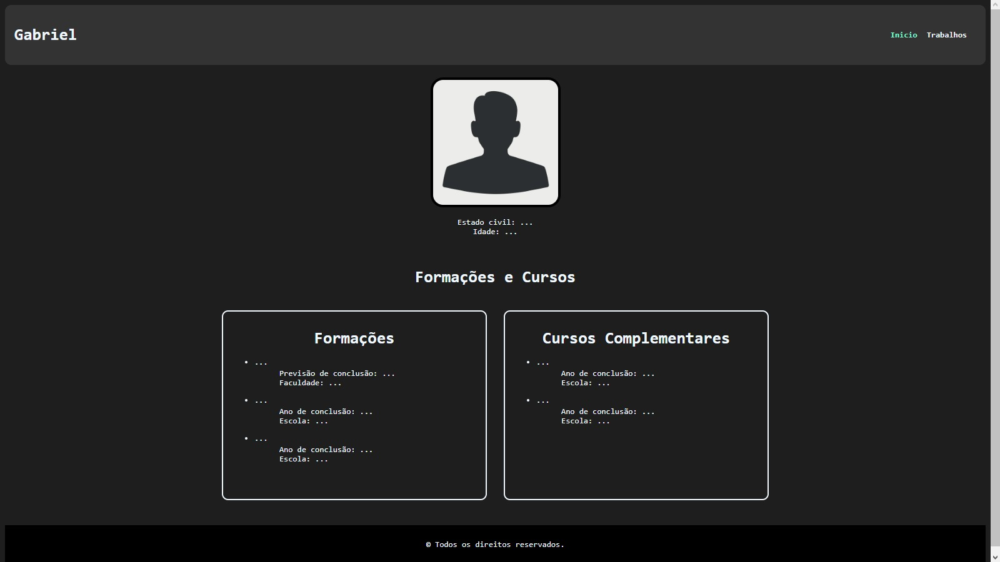

# Meu Curriculo

Um site breve sobre algumas informações do meu currículo

## 🚀 Acessando o site

<h4>Você pode acessar o site pelo link</h4> https://curriculo-aleixo-52c42a.netlify.app

## Imagens do site

    

    

    

    

## 🛠️ Construído com

Visual Studio Code utilizando HTML e CSS.

